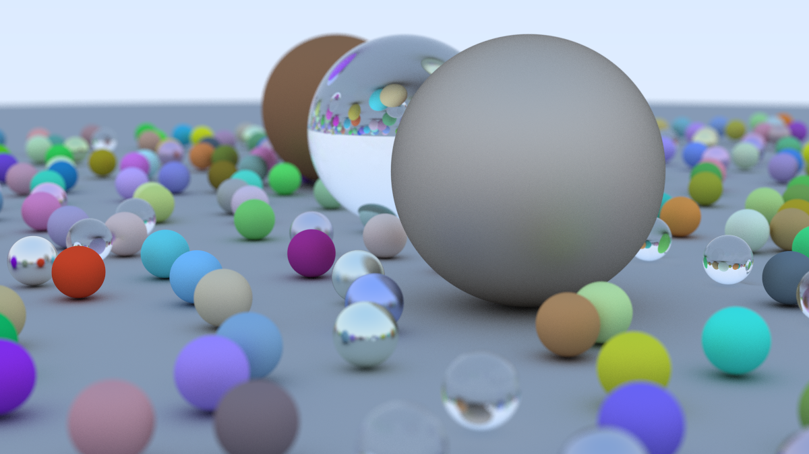

# Ray Tracing in One Weekend — Python

A Python implementation of [_Ray Tracing in One Weekend_](https://raytracing.github.io/books/RayTracingInOneWeekend.html) by Peter Shirley, Trevor David Black and Steve Hollasch.



## Features

- Spheres with a surface normal and closest-hit search
- Materials
  - **Lambertian** — diffuse surfaces
  - **Metal** — mirror reflection with adjustable fuzz
  - **Dielectric** — glass with refraction (Snell's law), total internal reflection and Schlick reflectance
- Positionable camera (`lookfrom`, `lookat`, `up`, vertical field of view)
- Defocus blur (depth of field) using a thin-lens model
- Anti-aliasing with multiple random samples per pixel
- Gamma correction
- Rendering in parallel across CPU cores with `multiprocessing`
- A bounding volume hierarchy (BVH) to speed up ray–scene intersection (from the next book in the series, [_Ray Tracing: The Next Week_](https://raytracing.github.io/books/RayTracingTheNextWeek.html))

## Project structure

| File | Contents |
|---|---|
| `vec3.py` | `Vec3` vector class and random disk sampling |
| `ray.py` | `Ray` — origin, direction and `at(t)` |
| `hitable.py` | `HitRecord`, `Sphere`, `HittableList` and the BVH |
| `material.py` | `Lambertian`, `Metal` and `Dielectric` materials |
| `camera.py` | Camera with field of view and defocus blur |
| `ppm_out.py` | Small scene: three spheres with defocus blur |
| `final_out.py` | The book's final scene: hundreds of random spheres |

## Requirements

- Python 3.10+
- NumPy

```sh
pip install -r requirements.txt
```

## Usage

```sh
python ppm_out.py     # small scene, 400×225
python final_out.py   # final scene, 1200×675 at 500 samples per pixel
```

Both scripts write `output.ppm`. Convert it to PNG with any image tool, for example on macOS:

```sh
sips -s format png output.ppm --out output.png
```

The full final render is slow in pure Python. For a quick preview, lower `width` and `samples_per_pixel` in `print_ppm()` in `final_out.py` (for example `width = 400`, `samples_per_pixel = 50`).
